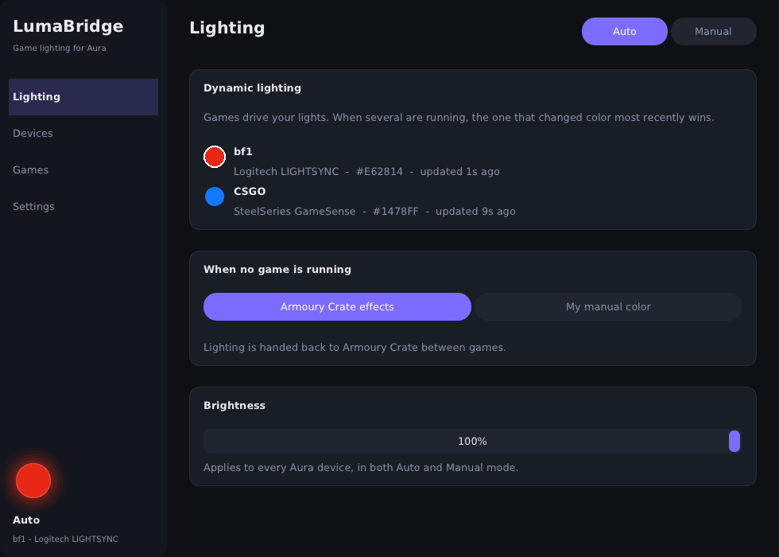

# LumaBridge

Dynamic game lighting on ASUS Aura Sync devices (motherboard, RAM, fans, GPU, Aura
keyboards like the ROG Azoth), plus any brand's devices with Windows' lighting standard
built in, including in games that only support other brands. No middleware needed.



- **Dashboard:** lighting, the running game, CPU / GPU load and temperatures, memory, fan
  speeds, power and clocks, drives, devices and connections at a glance. Cards can be hidden
  and reordered. Fan speeds, CPU temperature and power come from LumaBridge itself once
  Hardware access is set up (AMD Ryzen and Intel CPUs, Nuvoton NCT679x boards), else from
  LibreHardwareMonitor if it runs.
- **My setup:** your PC and desk in 3D, live: the case with everything LumaBridge found
  inside (motherboard, CPU cooler, memory, graphics card, drives, fans), the monitor,
  keyboard, mouse and other lit devices on the desk. LEDs show their live colors, fans spin
  with the speeds the sensors report, and the airflow moves through the case. Drag things
  around, turn the view, and correct LumaBridge's guess of where the fans sit and which way
  they blow. The Lighting page shows the same view: click a lit part to edit its lighting.
- **Auto mode:** games drive your lights. LumaBridge answers the game's lighting SDK as
  if that brand's software were installed, and follows the game that's currently active.
  Every running game is listed, with whether it supports dynamic lighting. Counter-Strike 2,
  Rocket League and War Thunder light up through their official data feeds, and games
  without lighting can mirror the screen's colors ([docs/games.md](docs/games.md)).
- **Manual mode:** effects (static, breathing, strobe, color cycle, and per-LED rainbow
  wave, gradient, comet and twinkle that run around each ARGB fan), each with ready-made
  presets such as gradients, a customizable rainbow (hue range, intensity, rainbows per fan,
  direction), and the same color wheel, hex input and swatches for both colors.
- **Calibration:** per-channel gains and gamma so Aura matches your other gear.
- **Logitech devices** (mice, ...) follow along through G HUB's own LED SDK.
- **RAM** (HyperX / Kingston FURY RGB DDR4, experimental) follows along, and the dashboard
  shows fan speeds and CPU / board temperatures by itself: one click on the Devices page
  (Hardware access) sets it up, with the signed PawnIO driver included
  ([third_party/pawnio](third_party/pawnio/README.md)). No LibreHardwareMonitor needed.
- **Setup guide:** on first start, LumaBridge finds your RGB hardware and lighting software,
  asks you to confirm it and your fans, and sets up its connections to match.
- **Devices:** only what your PC has (a mouse without RGB is left out); switch devices on or
  off, and set up your fans (count, LEDs per fan, test pattern). Other RGB brands are
  recognised and named.
- **Windows Dynamic Lighting devices:** keyboards, mice, headsets, cases and strips of any
  brand with Windows 11's lighting standard (HID LampArray) in their firmware follow
  LumaBridge lamp by lamp, with no software from their maker.
- **OpenRGB (only if you already use it):** off unless OpenRGB is on the PC; then what it
  supports can follow LumaBridge too. LumaBridge never needs it.
- **Games List:** every game on the PC; open one to set up its built-in lighting (CS2,
  Rocket League, War Thunder) or choose what it shows without lighting, including its own color.
- **Integrations:** one-click setup per SDK, with live status.
- Lives in the tray, starts with Windows if you want. The tray icon glows in the current
  color.

| Game SDK | Coverage | Your own devices of that brand |
|---|---|---|
| Logitech LIGHTSYNC | BF1 and other LIGHTSYNC titles | keep working (calls are forwarded to G HUB) |
| Razer Chroma | the largest RGB game catalogue | n/a (no Razer software needed) |
| SteelSeries GameSense | GameSense titles | n/a (built into the app) |
| Corsair iCUE (SDK 2/3) | per game folder | n/a |
| Alienware AlienFX | older titles | n/a |

Details and limits for each one are in [docs/sdk-emulators.md](docs/sdk-emulators.md).

```
 game ─LogiLed─▶ LumaBridge_x64.dll ─forward─▶ G HUB ─▶ Logitech mouse
 game ─Chroma──▶ RzChromaSDK64.dll ──┐
 game ─iCUE────▶ CUESDK.x64_2019.dll ┼─ colors (WM_COPYDATA) ─▶ LumaBridge.exe ─USB─▶ Aura LED controller
 game ─LightFX─▶ LightFX.dll ────────┘                            ▲              (motherboard + ARGB fans)
 game ─HTTP────────────────────────────────────── GameSense ──────┘ ─forward─▶ SteelSeries GG
```

Game lighting needs the app running. The DLLs inside games never load ASUS's Aura library
themselves by default, because a crash in it would take the game down with it
(`[Aura] DirectFromGames=1` allows it).

## Status

Everything compiles for x64 and x86 (mingw-w64 cross-build, and MSVC in CI). The
platform-independent logic (color math, effects, Chroma/Corsair/LightFX/GameSense
translation, JSON, HTTP, IPC, source selection) is covered by unit tests. **Nothing has
been run against real hardware yet.** Start with the checks under
[Verify on hardware](docs/roadmap.md#verify-on-hardware-next).

| Milestone | State |
|---|---|
| 1. LogiLed proxy with pass-through | implemented |
| 2. Aura bridge (`aura-test.exe`) | implemented |
| 3. Ambient mirror (static, per-key frames reduced, flash/pulse) | implemented |
| 3b. Chroma, GameSense, Corsair, LightFX front-ends | implemented |
| 5. App: Auto/Manual, calibration, devices, integrations, tray, autostart | implemented |
| 4. Per-key output on the Azoth | planned ([roadmap](docs/roadmap.md)) |

## Quick start

1. Check your hardware once: run `Run-HardwareTest.ps1` (see below) and make sure the
   motherboard and fans turn red/green.
2. Build ([docs/building.md](docs/building.md)) or download the `LumaBridge-x64` artifact
   from the latest GitHub Actions run, and unzip it anywhere, e.g.
   `C:\Program Files\LumaBridge`.
3. Run `LumaBridge.exe`. Under **Games**, set up the SDKs you want (Logitech is one
   click; Chroma and AlienFX ask for admin once; Corsair is per game).
4. Start a game. It appears on the **Lighting** page, and your Aura devices follow it.

Hardware check: run `powershell -ExecutionPolicy Bypass -File .\tools\Run-HardwareTest.ps1`
from the LumaBridge folder. It tests your lighting step by step and produces one report to share.

Troubleshooting: **Settings → Open log folder** (`%LOCALAPPDATA%\LumaBridge`). Each piece
writes its own log (`lumabridge-app.log`, `lumabridge.log` for the Logitech proxy,
`lumabridge-chroma.log`, …).

## What's in the download

```
LumaBridge\
  LumaBridge.exe              the app, the only thing you normally start
  LumaBridge.ini.example      all settings (the app edits them for you)
  integrations\               game SDK stand-ins, installed from the app's Integrations page
    x86\                      32-bit versions for older games
  tools\                      hardware tests (Run-HardwareTest.ps1 runs them all)
  scripts\                    install helpers the app runs for you
```

## Repo layout

```
src/app/                       LumaBridge.exe: UI (Dear ImGui + D3D11), tray, controller
src/core/                      shared: colors, effects, config, log, JSON, IPC
src/hardware/                  reaching Aura hardware: aura-usb/ (default), aura-sdk/, the mirror
src/integrations/logitech/     Logitech LED SDK proxy (pass-through to G HUB)
src/integrations/razer/        Razer Chroma emulator
src/integrations/corsair/      Corsair CUE SDK emulator
src/integrations/alienware/    Alienware LightFX emulator
src/integrations/steelseries/  SteelSeries GameSense server (+ forwarding to GG)
tools/                         aura-test, aura-usb-test, ram-probe, logiled-harness
scripts/                       install helpers + Run-HardwareTest.ps1
tests/                         unit tests (run on any OS)
docs/                          SDK notes, build guide, roadmap, release notes, screenshots
```

## Known limits

- **Supported Aura hardware:** the motherboard's Aura USB controller (board LEDs and ARGB
  headers, e.g. fans on a hub), driven directly over USB. RAM lighting (HyperX / Kingston
  FURY RGB DDR4 only, AMD chipsets, experimental) and the built-in sensors need Hardware access
  set up once, with one administrator prompt ([docs/peripherals.md](docs/peripherals.md)).
- **Some newer Chroma titles verify Razer's signature** and ignore the emulator.
- **Corsair iCUE SDK 4** (2022+ titles) and **Windows 11 Dynamic Lighting** aren't
  covered. See [docs/sdk-emulators.md](docs/sdk-emulators.md) for why.
- **Anti-cheat:** nothing touches game memory. The DLLs are ordinary libraries the game
  loads on purpose, the same technique Aurora and Artemis have used for years. Still,
  check a kernel anti-cheat title before trusting it with your account.
