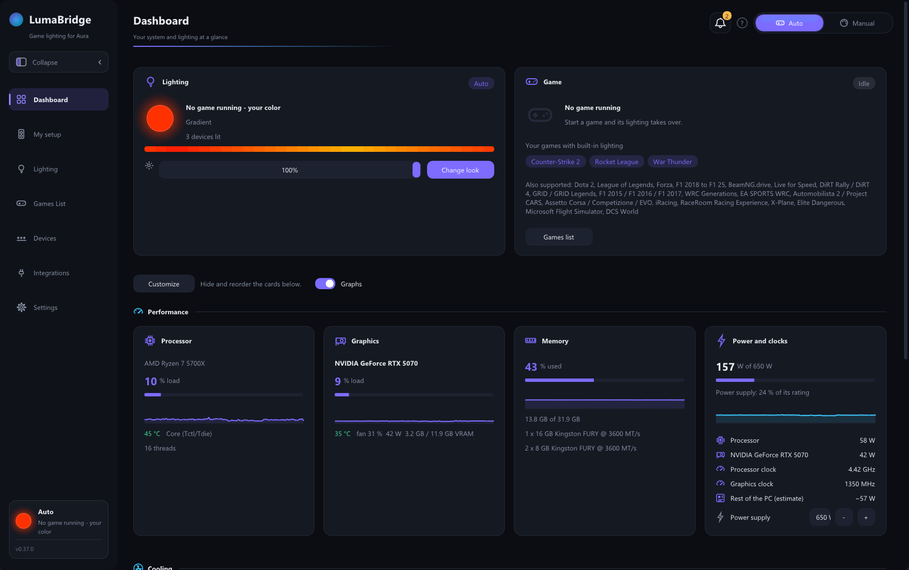
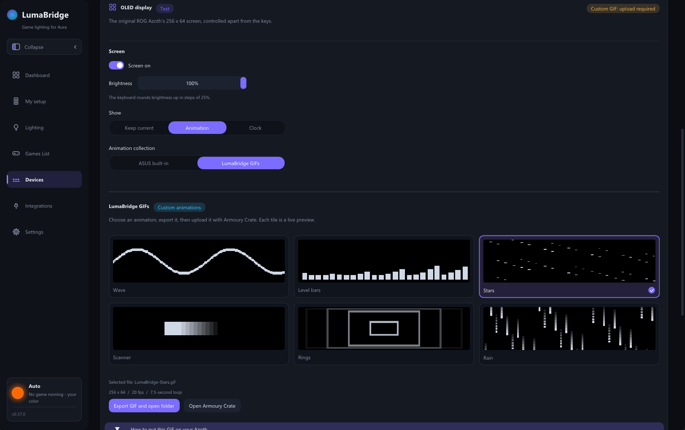

# LumaBridge

**Your game. Your lights. Your whole setup.**

Dynamic game lighting across ASUS Aura, Logitech and other RGB hardware,
with a live view of your PC and desk.

**[Download for Windows](https://github.com/EmilB04/LumaBridge/releases)** ·
[Game support](docs/games.md) · [Hardware guide](docs/peripherals.md) ·
[Build from source](docs/building.md)

LumaBridge brings game lighting to devices the game may not support itself. It uses
official game data feeds and compatible lighting SDKs, then sends the effects to your
connected hardware. Choose **Auto** to follow games or **Manual** to create your own look.

## Get started

1. Download `LumaBridge-vX.Y.Z.zip` from the [releases page](https://github.com/EmilB04/LumaBridge/releases)
   and extract the whole folder to a writable location.
2. Run **LumaBridge.exe**. Follow the setup guide to discover your hardware and confirm
   your fans and connections.
3. Open **Integrations** to set up the lighting SDKs you need. For games with built-in
   data feeds, open their tile in **Games List** and follow the setup instructions.
4. Select **Auto** and start a game. Choose your lighting between games on the
   **Lighting** page, or switch to **Manual** for effects and colors of your own.

Keep LumaBridge running for game lighting. In **Settings**, you can enable startup with
Windows and choose whether closing the window keeps the app in the tray.

Most native lighting connections do not need the manufacturer's app. Some devices use
G HUB or an optional OpenRGB SDK server. Native RAM lighting and additional sensors need
**Devices → Hardware access**, which installs the included signed PawnIO driver and helper
with an administrator prompt.

## Explore your setup

| Page | What you can do |
|---|---|
| **Dashboard** | See the current lighting, active game, CPU/GPU load, temperatures, memory, power and cooling readings. Hide or reorder cards and follow recent readings in graphs. |
| **My setup** | Explore your PC and desk in 3D, with live colors, moving fans and airflow. Arrange devices, correct monitor sizes and configure the case, fans and cooler. |
| **Lighting** | Build a look with static color, breathing, strobe, color cycle, rainbow wave, gradient, comet or twinkle. Set brightness, direction and individual device overrides. |
| **Games List** | Find installed games, set up their data feeds and choose screen colors or a fallback look for games without supported lighting. |
| **Devices** | Control lighting, view readings and browse everything Windows reports in the searchable **All hardware** inventory. |
| **Integrations** | Set up game SDKs, Windows lighting devices and OpenRGB, with connection status and recovery controls. |

### Live system readings

### Your PC and desk in 3D

### Azoth OLED previews

Preview six custom animations and export a **256 × 64 GIF**, then upload it through
Armoury Crate using the illustrated guide in the app. Direct screen power, brightness,
ASUS built-in animations and a local clock are also available as experimental controls.
Custom GIFs still require the Armoury Crate upload step.

These previews are captured from the native Windows app with connected hardware.
[Image details](docs/images/README.md).

## Game lighting

**Built-in feeds** use official data published by the game. Supported titles include
Counter-Strike 2, Rocket League, War Thunder, Dota 2, League of Legends, Forza, F1,
Assetto Corsa, iRacing, BeamNG.drive, Elite Dangerous, Microsoft Flight Simulator and
DCS World. Each game has its own setup and effects; see the [game guide](docs/games.md)
for the complete list.

**SDK integrations** receive the lighting a game sends to another brand's software:

| Integration | Setup |
|---|---|
| Logitech LIGHTSYNC | Per-user SDK redirect; existing Logitech output can pass through to G HUB. |
| Razer Chroma | Emulator installation; administrator access required. Some titles require Razer-signed libraries. |
| SteelSeries GameSense | Local server built into LumaBridge; can forward events to SteelSeries GG. |
| Corsair iCUE SDK 2/3 | Per-game library installation. SDK 4 is not supported. |
| Alienware AlienFX | Emulator installation; administrator access required. |

The Games List includes a catalogue of roughly 460 additional SDK titles. A catalogue
entry identifies the game's lighting integration; it does not guarantee compatibility
with every game version. [SDK setup and limitations](docs/sdk-emulators.md).

**Screen colors** mirror the primary monitor for games without supported lighting,
with separate colors from its left and right halves. Enable this globally or per game.

LumaBridge does not read game memory or inject code. SDK integrations use libraries the
game normally loads; some games or anti-cheat systems refuse replacements. Those titles
can use screen colors where available.

## Hardware connections

Support depends on the device's model, firmware and connection. These are lighting
connections; vendor apps still handle firmware updates, macros and cooling configuration.

| Hardware | Connection and scope |
|---|---|
| **ASUS Aura motherboard / ARGB** | Direct USB control of supported motherboard LEDs and ARGB headers, including fans and strips. Optional Aura SDK backend. |
| **ROG Azoth** | Direct per-key lighting over USB or the ROG Omni receiver; experimental OLED controls and GIF export. |
| **Logitech** | Direct HID++ for supported mice; G502 X Plus supports individual LEDs. Other RGB gear can use G HUB's LED SDK, which sends one color. |
| **HyperX / Kingston FURY RGB DDR4** | Experimental native control through Hardware access. AMD PIIX4 and Intel I801 supported; Intel lighting still needs physical validation. Other controller families and DDR5 can use OpenRGB where supported. |
| **Windows lighting devices** | Native HID LampArray output for devices that expose Windows' lighting standard in their firmware. |
| **OpenRGB devices** | Optional local SDK server for supported RAM, GPUs, coolers, peripherals and RGB controllers. Coverage depends on OpenRGB's drivers and configuration. |
| **DualSense / DualShock 4** | Controller lighting and live input views over USB or Bluetooth. DualSense lighting is experimental; DualShock 4 is unverified on physical hardware. |
| **NZXT Kraken** | Liquid temperature, pump and fan readings on supported models alongside CAM. Native X53/X63/X73 and Z53/Z63/Z73 RGB outputs are experimental and physically unverified; LCDs and cooling curves remain with CAM. |

A working native output takes priority over OpenRGB by default. Each OpenRGB device has
its own saved control switch. See the [hardware guide](docs/peripherals.md) for connection
requirements and device-specific scope.

### Sleep and power saving

Before PC sleep, LumaBridge turns off fan and Logitech lighting and pauses updates until
wake. Logitech mice and the Azoth can fade out after their own inactivity timeout without
continued lighting traffic keeping them awake.

For the Azoth, LumaBridge overrides the firmware timer while controlling the keyboard,
then turns off both keys and OLED at the selected timeout. The ASUS timer is restored
when control ends. **Stay awake while a game controls the lighting** applies only to an
active game lighting feed; desktop colors and animated presets still sleep normally.

## Help and development

LumaBridge is a pre-release project by **[EmilB04](https://github.com/EmilB04)**. ASUS Aura,
ROG Azoth, Logitech G502 X Plus, HyperX/Kingston RGB DDR4 and Kraken readings have been
used on the author's PC; other models and experimental outputs need further testing.

- **Troubleshooting:** open **Settings → Open log folder**. Logs and settings live in
  `%LOCALAPPDATA%\LumaBridge`. Include the relevant log and device model in a
  [bug report](https://github.com/EmilB04/LumaBridge/issues).
- **Hardware checks:** run `tools\Run-HardwareTest.ps1` from the extracted download for
  guided lighting tests and a report.
- **Build:** [Windows/MSVC and Linux/WSL build instructions](docs/building.md).
  The app uses C++, Dear ImGui and Direct3D 11; portable core tests run on Linux as well.
- **Project direction:** [roadmap](docs/roadmap.md) · [release notes and versioning](docs/releases/README.md).

<strong>Repository layout</strong>

| Directory | Contents |
|---|---|
| `src/app/` | Windows UI, device outputs, game feeds, dashboard and tray. |
| `src/core/` | Shared colors, effects, settings, logging, JSON and IPC. |
| `src/hardware/` | Native Aura connections and shared hardware access. |
| `src/integrations/` | Logitech, Razer, Corsair, Alienware and SteelSeries SDK integrations. |
| `tests/` | Portable core tests. |
| `tools/`, `scripts/` | Diagnostics and installation helpers. |
| `docs/` | Hardware/game guides, build instructions, research and release notes. |

