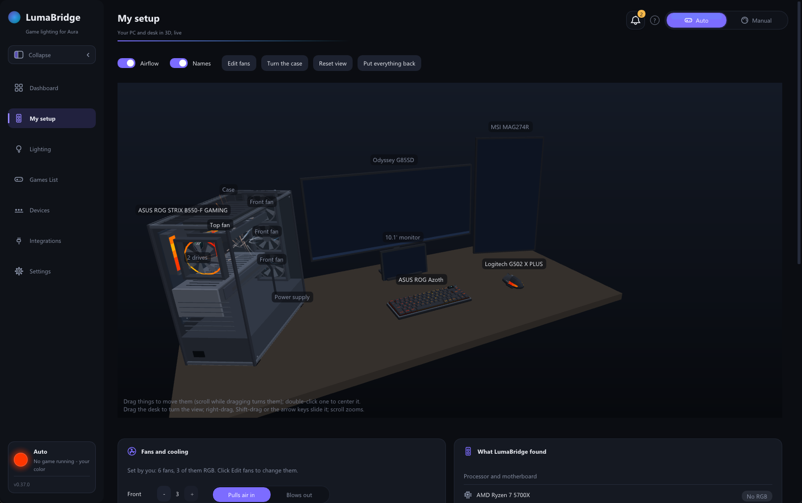
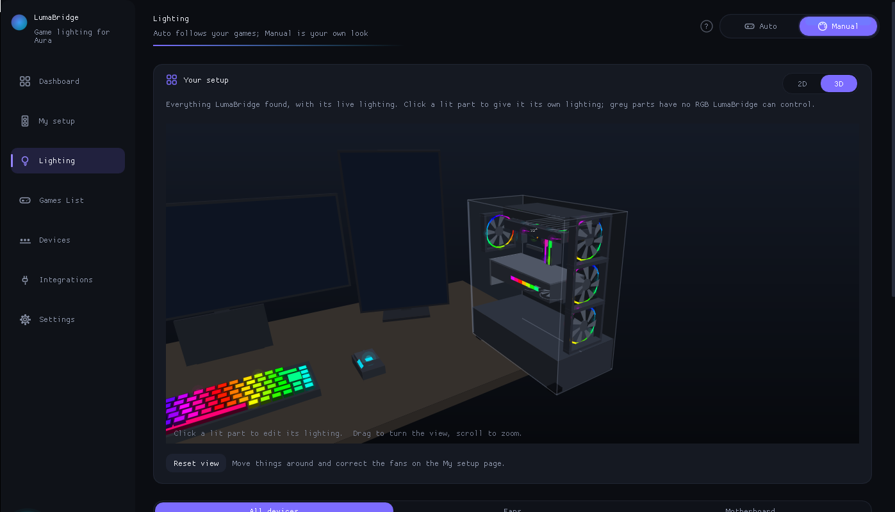

# LumaBridge

Dynamic game lighting on ASUS Aura Sync devices (motherboard, RAM, fans, Aura keyboards
like the ROG Azoth), Logitech gear through G HUB, a DualSense controller's lightbar
(experimental), and any brand's devices with Windows' lighting standard built in, including
in games that only support other brands. No middleware needed. It also shows your whole PC
and desk in 3D, live.



- **My setup:** your PC and desk in 3D, live. The case holds everything LumaBridge found
  (motherboard, CPU with its air cooler or AIO, memory in its slots, graphics card, drives,
  fans), and every monitor stands on the desk as Windows has your displays arranged (small
  screens under 16" rest on the desk, under the monitor above them if that's where Windows
  has them). LEDs show their live colors, fans and the pump spin at the speeds reported, and
  wind streaks show the airflow. Drag and turn things on the desk; slide, turn and zoom the
  view; correct how many fans sit where, which way they blow, and the cooler (air or AIO,
  radiator on top or in front, RGB pump). Next to it, everything found, grouped: processor
  and motherboard, graphics, cooling, storage, monitors and the desk.
- **Monitor sizes:** if a monitor reports the wrong size, enter its diagonal in inches under
  **My setup → Monitors**. Each correction is saved for that monitor and updates its size and
  placement in both 3D views. Use **Use reported size** to restore automatic sizing.
- **DualSense model:** a detailed two-tone controller on the desk, with shaped grips,
  touchpad, sticks, face buttons and triggers. Its light strips follow the controller's
  actual lightbar color; drag and rotate it like the keyboard and mouse.
- **DualSense Bluetooth:** wireless lighting handles Windows HID report sizes, initializes
  the controller lightbar on connection, and resumes after lighting control is handed back.
- **Controller page:** a connected DualSense or DualShock 4 (USB or Bluetooth) shows as a
  3D controller that follows it live: held buttons light up and sink, the sticks lean, the
  triggers travel and fingers show on the touchpad. Drag to turn it. The lightbar shows its
  current color, with its hex and RGB values. Raw stick, trigger and motion numbers, and
  how steadily the controller reports, change many times a second, so each sits behind its
  own switch (off by default). The battery is shown too. A button mapping (off until you
  switch it on) makes buttons press keyboard keys or mouse buttons, and can move the mouse
  with the right stick. DualShock 4 is untested on real hardware.
- **Monitor supports:** stands sit behind the screen instead of poking through it; vertical
  monitors and small desk panels have no stand.
- **Detailed 3D setup:** sculpted keyboard keys with legends, the Azoth's screen and knob,
  a curved mouse with separate buttons, wheel, thumb rest and light strips, and a PC chassis
  with vents, glass, connectors and component detail. A depth buffer keeps parts correctly
  in front of or behind each other as you rotate and zoom the view.
- **Dashboard:** lighting, the running game, CPU / GPU load, temperatures, clocks and power,
  memory, fan speeds, drives, devices and connections at a glance, with graphs of the last
  two minutes (can be turned off). Power and clocks shows what the whole PC draws out of your
  power supply's rating (Corsair HXi / RMi and NZXT E supplies are recognised; for others,
  enter the watts from its label). Cards can be hidden and reordered. Fan speeds, CPU temperature and power come from LumaBridge itself once Hardware
  access is set up (AMD Ryzen and Intel CPUs, Nuvoton NCT679x boards), else from
  LibreHardwareMonitor if it runs.
- **Auto mode:** games drive your lights. LumaBridge answers the game's lighting SDK as
  if that brand's software were installed, and follows the game that's currently active.
  Counter-Strike 2, Rocket League, War Thunder, Dota 2, League of Legends, Forza, F1,
  BeamNG.drive, DiRT Rally, Automobilista 2 / Project CARS 2, X-Plane, Elite Dangerous,
  Microsoft Flight Simulator and DCS World light up through their own data feeds, and games
  without lighting can mirror the screen's colors ([docs/games.md](docs/games.md)).
- **Manual mode:** effects (static, breathing, strobe, color cycle, and per-LED rainbow
  wave, gradient, comet and twinkle that run around each ARGB fan), presets, a customizable
  rainbow and the same color wheel, hex input and swatches for both colors. Give any device
  its own lighting, brightness and direction, or hand it back to its own app.
- **Lighting page:** your saved manual color, color values and effect take priority. In Auto
  mode, choosing "My manual color" between games shows that saved look with a "Switch to
  Manual" button to use and edit it. Expand "Your setup" for a live 2D or 3D preview in either
  mode; in Manual, click a lit part to edit its lighting. The 2D DualSense shows its white grips, touchpad, sticks,
  D-pad and face buttons, with the live lighting on the touchpad light strips. Fans have
  curved blades and diffuser rings; the board shows its socket, heatsinks, slots and RAM
  latches. The mouse has a shaped shell and continuous light strip, the keyboard has key
  legends and an OLED, and headsets, graphics cards and light bars have distinct housings.
- **NZXT Kraken:** LumaBridge recognises Kraken AIOs (and Corsair and ASUS ROG ones) on USB
  and reads a Kraken's liquid temperature, pump and fan speeds, alongside NZXT CAM. They
  show on the dashboard, on Devices and in My setup, where the pump's screen shows the liquid
  temperature. NZXT CAM keeps the Kraken's lighting and screen.
- **Devices:** opens on **Lighting and readings**, with grouped lighting controls and live
  readings. The header counts active lighting devices across all outputs, including
  peripherals and RAM, rather than only Aura. The optional **All hardware** tab has a
  searchable, categorized inventory of every device Windows reports as
  present (USB, Bluetooth, PCI, storage, audio, network, monitors and system / software
  devices), plus the motherboard and memory modules from firmware. Each Windows device
  function keeps its own entry and ID; driver problems are shown without assuming RGB
  support. The inventory refreshes in the background every minute or on Rescan. Under
  **Lighting and readings**, grouped controls let you switch lights on or off, set up fans
  (count, LEDs per fan, test pattern), choose memory slots and view cooler / GPU readings.
- **Logitech devices** (mice, ...) follow along through G HUB's own LED SDK.
- **RAM** (HyperX / Kingston FURY RGB DDR4, experimental) follows along, and the dashboard
  shows fan speeds and CPU / board temperatures by itself: one click on the Devices page
  (Hardware access) sets it up, with the signed PawnIO driver included
  ([third_party/pawnio](third_party/pawnio/README.md)). AMD PIIX4 and Intel I801 chipsets are
  supported; Intel lighting is experimental and needs physical hardware testing. Existing
  installations need **Hardware access > Set up again** to install the Intel module. Modern
  Fury controller families, DDR5 and other RAM brands use the broader OpenRGB connection.
  No LibreHardwareMonitor needed.
- **Windows Dynamic Lighting devices:** keyboards, mice, headsets, cases and strips of any
  brand with Windows 11's lighting standard (HID LampArray) in their firmware follow
  LumaBridge lamp by lamp, with no software from their maker.
- **Broad RGB discovery:** Windows lighting devices and a local OpenRGB SDK server are
  discovered automatically, even when their lighting control is off. **Devices** groups
  fan/RGB controllers, individual memory modules, peripherals, coolers and graphics cards.
  Installed RAM modules are read from firmware by slot, maker and part number, independently
  of whether a lighting driver can control them.
- **OpenRGB:** for the many RAM, GPU, cooler, peripheral and controller families outside
  LumaBridge's native drivers, run OpenRGB and choose **SDK Server > Start Server**, then
  enable **Integrations > OpenRGB > Lighting control**. Every RGB device its server exposes
  can follow LumaBridge, without a LumaBridge brand/model whitelist. A working native
  connection takes priority by default; failed/unavailable native RAM and peripheral
  connections allow OpenRGB as a fallback. Each device has an independent saved switch,
  including identical RAM/controller models; older name-based settings are retained.
  Hot-plug changes and reconnections refresh automatically, and disabling control restores
  the previous OpenRGB mode. Coverage depends on [OpenRGB's device support](https://openrgb.org/devices_pipeline.html)
  and configuration; installing LumaBridge alone does not add those hardware drivers.
- **NZXT Kraken lighting (experimental):** X53/X63/X73 pump ring, logo and attached NZXT RGB
  accessories, and Z53/Z63/Z73 external RGB accessories, can follow LumaBridge directly.
  Enable it on the cooler's device page. These native lighting writes are protocol-tested
  but have not been verified on those physical models. Commands follow the documented
  [liquidctl Kraken protocol](https://github.com/liquidctl/liquidctl/blob/main/liquidctl/driver/kraken3.py).
  Disabling stops color writes; CAM can take over, otherwise the last color remains.
  LCDs and pump/fan curves stay with CAM. Newer LCD models such as USB `1E71:300E` have
  no supported RGB channel on that USB connection: RGB fans use their motherboard header
  or a separate lighting controller. Their existing temperature/RPM readings still work.
- **Games List:** every game on the PC; open one to set up its built-in lighting or choose
  what it shows without lighting, including its own color.
- **Setup guide:** on first start, LumaBridge finds your RGB hardware and lighting software,
  asks you to confirm it and your fans, and sets up its connections to match.
- **Integrations:** one-click setup per SDK, with live status.
- **Notifications:** the bell at the top shows what needs your attention (a lighting
  service that stopped, a busy game port, a low controller battery), most serious first,
  each with a button that opens the right page. Dismiss one with its cross; dismissed
  notices can be shown again, and come back by themselves if the problem returns.
- **Calibration:** per-channel gains and gamma so Aura matches your other gear.
- Starts with Windows if you want; the tray icon glows in the current color. Closing the
  window exits LumaBridge (minimize it to keep it running, or have closing keep it in the
  tray, in Settings).



| Game SDK | Coverage | Your own devices of that brand |
|---|---|---|
| Logitech LIGHTSYNC | BF1 and other LIGHTSYNC titles | keep working (calls are forwarded to G HUB) |
| Razer Chroma | the largest RGB game catalogue | n/a (no Razer software needed) |
| SteelSeries GameSense | GameSense titles | n/a (built into the app) |
| Corsair iCUE (SDK 2/3) | per game folder | n/a |
| Alienware AlienFX | older titles | n/a |

Details and limits for each one are in [docs/sdk-emulators.md](docs/sdk-emulators.md).

```
 game ─LogiLed─▶ LumaBridge_x64.dll ─forward─▶ G HUB ─▶ Logitech mouse
 game ─Chroma──▶ RzChromaSDK64.dll ──┐
 game ─iCUE────▶ CUESDK.x64_2019.dll ┼─ colors (WM_COPYDATA) ─▶ LumaBridge.exe ─USB─▶ Aura LED controller
 game ─LightFX─▶ LightFX.dll ────────┘                            ▲              (motherboard + ARGB fans)
 game ─HTTP────────────────────────────────────── GameSense ──────┘ ─forward─▶ SteelSeries GG
```

Game lighting needs the app running. The DLLs inside games never load ASUS's Aura library
themselves by default, because a crash in it would take the game down with it
(`[Aura] DirectFromGames=1` allows it).

## Status

Pre-release. Everything compiles for x64 and x86 (mingw-w64 cross-build, and MSVC in CI),
and the platform-independent logic (color math, effects, SDK translation, game feeds, the
3D layout, JSON, HTTP, IPC, source selection) is covered by unit tests. It runs on the
author's PC (ASUS Aura board and ARGB fans, ROG Azoth, Logitech G502 X Plus, HyperX RGB
memory, NZXT Kraken); other hardware is less tested. The checks under
[Verify on hardware](docs/roadmap.md#verify-on-hardware-next) help on a new PC.

| Milestone | State |
|---|---|
| 1. LogiLed proxy with pass-through | implemented |
| 2. Aura bridge (`aura-test.exe`) | implemented |
| 3. Ambient mirror (static, per-key frames reduced, flash/pulse) | implemented |
| 3b. Chroma, GameSense, Corsair, LightFX front-ends | implemented |
| 5. App: Auto/Manual, calibration, devices, integrations, tray, autostart | implemented |
| 6. My setup: the PC and desk in 3D, AIO and monitor detection | implemented |
| 4. Per-key output on the Azoth | planned ([roadmap](docs/roadmap.md)) |

## Quick start

1. Check your hardware once: run `Run-HardwareTest.ps1` (see below) and make sure the
   motherboard and fans turn red/green.
2. Download `LumaBridge-vX.Y.Z.zip` from the
   [latest release](https://github.com/EmilB04/LumaBridge/releases) (or build it:
   [docs/building.md](docs/building.md)), and unzip it anywhere, e.g.
   `C:\Program Files\LumaBridge`.
3. Run `LumaBridge.exe`. The setup guide finds your hardware; under **Integrations**, set up
   the SDKs you want (Logitech is one click; Chroma and AlienFX ask for admin once; Corsair
   is per game).
4. Start a game. It appears on the **Lighting** page, and your Aura devices follow it.

Hardware check: run `powershell -ExecutionPolicy Bypass -File .\tools\Run-HardwareTest.ps1`
from the LumaBridge folder. It tests your lighting step by step and produces one report to share.

Troubleshooting: **Settings → Open log folder** (`%LOCALAPPDATA%\LumaBridge`). Each piece
writes its own log (`lumabridge-app.log`, `lumabridge.log` for the Logitech proxy,
`lumabridge-chroma.log`, …).

## What's in the download

```
LumaBridge\
  LumaBridge.exe              the app, the only thing you normally start
  LumaBridge.ini.example      all settings (the app edits them for you)
  integrations\               game SDK stand-ins, installed from the app's Integrations page
    x86\                      32-bit versions for older games
  tools\                      hardware tests (Run-HardwareTest.ps1 runs them all)
  scripts\                    install helpers the app runs for you
```

## Repo layout

```
src/app/                       LumaBridge.exe: UI (Dear ImGui + D3D11), tray, controller
src/core/                      shared: colors, effects, config, log, JSON, IPC
src/hardware/                  reaching Aura hardware: aura-usb/ (default), aura-sdk/, the mirror
src/integrations/logitech/     Logitech LED SDK proxy (pass-through to G HUB)
src/integrations/razer/        Razer Chroma emulator
src/integrations/corsair/      Corsair CUE SDK emulator
src/integrations/alienware/    Alienware LightFX emulator
src/integrations/steelseries/  SteelSeries GameSense server (+ forwarding to GG)
tools/                         aura-test, aura-usb-test, ram-probe, logiled-harness
scripts/                       install helpers + Run-HardwareTest.ps1
tests/                         unit tests (run on any OS)
docs/                          SDK notes, build guide, roadmap, release notes, screenshots
```

## Known limits

- **Supported Aura hardware:** the motherboard's Aura USB controller (board LEDs and ARGB
  headers, e.g. fans on a hub), driven directly over USB. RAM lighting (HyperX / Kingston
  FURY RGB DDR4 only, AMD chipsets, experimental) and the built-in sensors need Hardware access
  set up once, with one administrator prompt ([docs/peripherals.md](docs/peripherals.md)).
- **Some newer Chroma titles verify Razer's signature** and ignore the emulator.
- **Corsair iCUE SDK 4** (2022+ titles) and **Windows 11 Dynamic Lighting** aren't
  covered. See [docs/sdk-emulators.md](docs/sdk-emulators.md) for why.
- **Anti-cheat:** nothing touches game memory. The DLLs are ordinary libraries the game
  loads on purpose, the same technique Aurora and Artemis have used for years. Still,
  check a kernel anti-cheat title before trusting it with your account.
