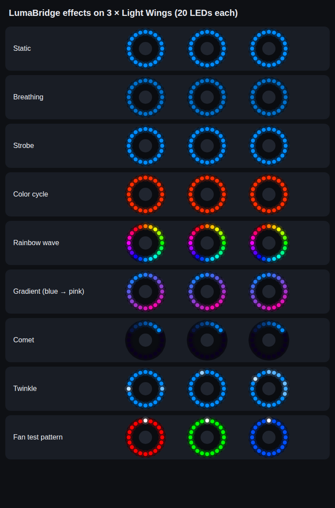

> **Pre-release.** Per-LED effects for ARGB fans, plus fixes for v0.2.8.

## New

- **Eight effects in Manual mode:** Static, Breathing, Strobe, Color cycle, and four new
  per-LED ones:
  - **Rainbow wave:** the whole spectrum around each fan, turning.
  - **Gradient:** your two colors blended around each fan, still or flowing.
  - **Comet:** a comet of your color with a fading tail chasing around each fan.
  - **Twinkle:** your color with random sparkles of a second color.
  The effects that use two colors have a **Second color** picker, plus **Swap** and
  **Off** (black) buttons.
- **Live preview:** the Lighting page shows your fans and the motherboard LEDs
  animating exactly as the hardware does.
- **Fan setup (Devices page):** the number of fans on the ARGB header, the LEDs per fan
  (20 for be quiet! Light Wings 120 mm), and whether every fan repeats the pattern or one
  pattern runs across all fans. **Show test pattern** gives each fan its own color with a
  white first LED, so you can check the count: with the right number, every fan is one
  solid color. If a color spills onto the next fan, change **LEDs per fan**.
- The idle **Rainbow** in Auto mode is now a slow rainbow wave.
- The motherboard's own LEDs show the per-LED effects too.

## Fixed

- **Silent hand-back left the lights frozen.** The hand-back task ran under your account
  in the background, where Windows didn't give it the rights needed to restart the
  lighting controller (the task ended with result 1). It now runs as SYSTEM, and your
  account is allowed to start it, so LumaBridge still triggers it without a prompt.
  **Open Games → Armoury Crate hand-back and click Set up again** to update the task.
  Every run is logged to `C:\ProgramData\LumaBridge\handback.log`.
- **Rescan showed 0 devices in Auto mode.** The device list only came from the part of
  LumaBridge that was controlling the lights. Devices are now also found with a read-only
  scan that leaves the lights with Armoury Crate, at startup and on **Rescan devices**.

## Download

**LumaBridge-v0.3.0.zip** below. Exit the running LumaBridge from the tray first.
